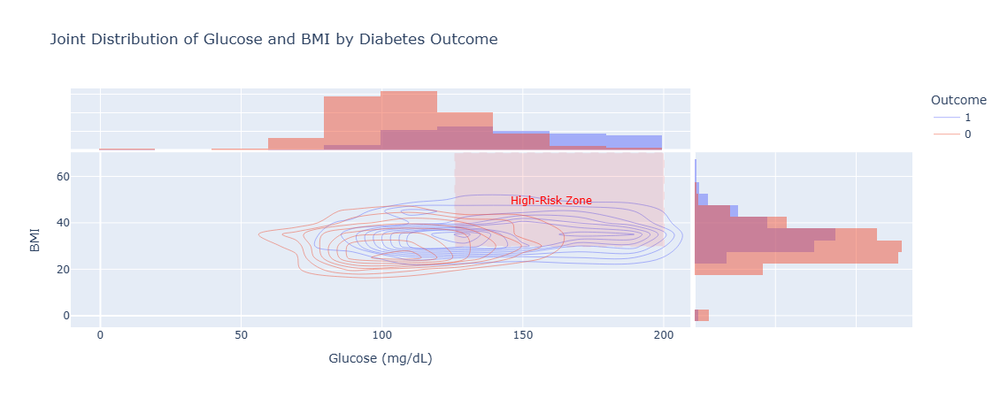

# 📊 Project Report: Diabetes Dataset Analysis & Prediction

---

## 1. Dataset Overview
- **Records**: 768  
- **Variables**: 9  
- **Data Types**: 7 int, 2 float  
- **Nulls**: None  
- **Duplicates**: None  
- **Memory Usage**: ~54 KB  

---

## 2. Variable-Level Summary

| Variable                     | Range (Min–Max) | Mean ± Std   | Notes on Distribution                              | Outliers             |
| ---------------------------- | --------------- | ------------ | -------------------------------------------------- | -------------------- |
| **Pregnancies**              | 0 – 17          | 3.85 ± 3.37  | Right-skewed; spread almost as wide as mean        | High (≥12–17)        |
| **Glucose**                  | 0 – 199         | 120.9 ± 32.0 | Reasonable spread; skewed right                    | Low (0), High (>180) |
| **BloodPressure**            | 0 – 122         | 69.1 ± 19.4  | Wide spread; implausible 0 values                  | Low (0), High (>110) |
| **SkinThickness**            | 0 – 99          | 20.5 ± 16.0  | Many zeros (Q1=0); right-skewed                    | High (>70)           |
| **Insulin**                  | 0 – 846         | 79.8 ± 115.2 | Extremely skewed; many zeros                       | High (>300)          |
| **BMI**                      | 0 – 67.1        | 32.0 ± 7.9   | Typical BMI spread; invalid zeros present          | Low (0), High (>50)  |
| **DiabetesPedigreeFunction** | 0.078 – 2.42    | 0.47 ± 0.33  | Right-skewed; large variability                    | High (>2.0)          |
| **Age**                      | 21 – 81         | 33.2 ± 11.8  | Spread across adults; skewed younger               | High (>70)           |
| **Outcome**                  | 0 – 1           | 0.35 ± 0.48  | Binary variable; ~35% positive cases              | None                 |

---

## 3. Issues Identified
1. **Hidden Missing Data (Fake Zeros)** in BloodPressure, SkinThickness, Insulin, and BMI.  
2. **Outliers** in Pregnancies (≥12), Insulin (>300), and Age (>70).  
3. **Skewed Distributions** in Insulin, Pedigree Function, Pregnancies, and Age.  
4. **Biological Implausibility**: BP = 0, BMI = 0, SkinThickness = 0 → invalid.  

---

## 4. Exploratory Analysis & Key Findings

### 4.1 Outcome Frequency
- **500 non-diabetic vs 268 diabetic patients** → **class imbalance**.  

### 4.2 Glucose by Outcome
- Diabetics have **higher glucose**, median >126 mg/dL.  

### 4.3 Missing Insulin vs Diabetes
- Similar diabetes prevalence across missing vs measured insulin.  

### 4.4 Joint Glucose & BMI
- **High-risk cluster** = high glucose + high BMI.  

### 4.5 BMI vs Age
- Diabetics consistently have **higher BMI across all ages**.  

### 4.6 Blood Pressure (Excluding Zeros)
- Slightly higher BP in diabetics; distributions overlap.  

### 4.7 Pedigree Function
- Higher values in diabetics → stronger genetic predisposition.  

### 4.8 Correlations
- **Top predictors**: Glucose (0.467), BMI (0.293), Age (0.238), Pregnancies (0.222), Pedigree (0.174).  
- Insulin & SkinThickness weak predictors.  

---

## 5. Modeling Approach

### 5.1 Preprocessing
- **RobustScaler** used for feature scaling.  
- **SMOTE** applied to balance classes (500 diabetic samples).  
- **Train/Test Split**: 90/10, stratified.  

### 5.2 Baseline Model Comparison (Before vs After SMOTE)

| Model          | Test Acc. (Before) | Test Acc. (After) |
| -------------- | ------------------ | ----------------- |
| Logistic Reg.  | 0.764              | 0.755             |
| Random Forest  | 0.759              | **0.821**         |
| SVM            | 0.772              | 0.794             |
| Linear SVM     | 0.766              | 0.755             |
| KNN            | 0.747              | 0.786             |
| CART           | 0.719              | 0.774             |
| ExtraTree      | 0.686              | 0.749             |

👉 **SMOTE improved performance** across most models.  

### 5.3 Hyperparameter Tuning
- **Random Forest (Best Model)**
  - Test Accuracy: **0.86**
  - Test AUC: **0.90**
  - No overfitting → excellent generalization.  

- **SVM**
  - Test Accuracy: 0.84
  - Test AUC: 0.87
  - Slight overfitting (train acc. 0.90).  

✅ **Best Choice: Random Forest**  
- Robust, stable, and generalizes well.  
- Saved as `Random Forest Classifier.pkl`.  

---

## 6. Deployment

A **Streamlit web app** was developed for real-time prediction.  

Features:
- User inputs (Pregnancies, Glucose, BP, BMI, etc.).  
- Model predicts **Diabetes Positive / Negative** with probability.  
- Simple and interactive interface.  

---

## 7. Summary & Conclusion

* **Glucose** = strongest predictor of diabetes.
* **BMI, Age, and Genetics** contribute significantly.
* **Random Forest** is the best performing model (86% accuracy, AUC 0.90).
* Class imbalance addressed via **SMOTE**.
* Deployed via **Streamlit App** for practical use.

---

## 8. Next Steps

* Further improve missing value imputation.
* Try ensemble methods (XGBoost, LightGBM).
* Deploy app on **Streamlit Cloud / Heroku**.
* Integrate with medical record systems.

---

